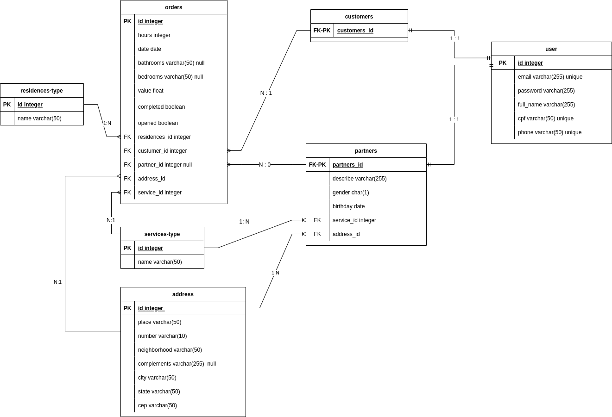

# Clean-Go



## Descrição
​
</br>
​
Backend de um app para serviços de limpeza e passadoria em residências. Os usuários possuem dois perfis: customer (cliente) e partner(prestador do serviço). O customer pode cadastrar o serviço que está precisando, informando algumas características da casa e preço que está disposto a pagar. O partner escolher os serviços que deseja fazer.
O objetivo deste projeto é criar em Django o Back de um projeto já existente em Front. As informações das tabelas ServiceType e ResidenceType já foram incluídas previamente.

</br>

## Tecnologias:

- Linguagem:
  - Python 3
- Framework:
  - Django com APIView
​<br>


## Endpoints

### Criação de usuários

#### POST `/api/customers/`

> Rota responsável pela criação de usuários do tipo customer. Não há autenticação para este endpoint. Isso significa que qualquer pessoa pode se cadastrar como customer.

- Corpo requisição:

```json
{
    "email": "johncustomer1@mail.com",
    "password": "1234",            
    "full_name": "John Field",
    "cpf": "222.222.222-13",
    "phone": "(11)98888-8887"
}
```

- Corpo da resposta:

```json
{
    "id": 1,
    "email": "johncustomer1@mail.com",
    "password": "1234",            
    "full_name": "John Field",
    "cpf": "222.222.222-13",
    "phone": "(11)98888-8887"
}
```

- Status: 201 CREATED
- Caso haja a tentativa de criação de um usuário que já está cadastrado o sistema responde com HTTP 409 - Conflict.
- Caso falte algum dos campos necessários, o sistema responde com HTTP 400 - Bad Request.

<br>

### Autenticação de customers

#### POST `/api/customers/login/`

> Rota responsável pelo login de usuários do tipo customers. 

- Corpo requisição:

```json
{
    "email": "johncustomer1@mail.com",
    "password": "1234"
}
```

- Corpo da resposta:

```json
{
    "token": "dfd384673e9127213de6116ca33257ce4aa203cf"
}
```

- Status: 200 OK

<br>

#### POST `/api/partners/`

> Rota responsável pela criação de usuários do tipo partner. Não há autenticação para este endpoint. Isso significa que qualquer pessoa pode se cadastrar como partner.

- Corpo requisição:

```json
{
    "full_name": "Jonh Partner",
	"email": "johnpartner1@mail.com",
	"password": "1234",
	"cpf": "111.111.111-39",
	"birthday": "1999-01-20",
	"phone": "(41)99999-9996",
	"gender": "M",
	"address": {
		"place": "Ruadas Araras",
		"number": "10",
		"neighborhood": "Vila Norte",
		"complements": "102",
		"city": "Rio de Janeiro",
		"state": "RJ",
		"cep": "82000000"
	},
	"services": "Limpeza Residencial",
	"describe": "A melhor limpeza para sua casa."
}
```

- Corpo da resposta:

```json
{   
    "id": 1,
    "full_name": "Jonh Partner",
	"email": "johnpartner1@mail.com",
	"password": "1234",
	"cpf": "111.111.111-39",
	"birthday": "1999-01-20",
	"phone": "(41)99999-9996",
	"gender": "M",
	"address": {
        "id": 1,
		"place": "Rua das Araras",
		"number": "10",
		"neighborhood": "Vila Norte",
		"complements": "102",
		"city": "Rio de Janeiro",
		"state": "RJ",
		"cep": "82000000"
	},
	"services": {
        "id": 1,
        "name": "Limpeza Residencial"
    },
	"describe": "A melhor limpeza para sua casa."
}
```

- Status: 201 CREATED
- Caso haja a tentativa de criação de um usuário que já está cadastrado o sistema responde com HTTP 409 - Conflict.
- Caso falte algum dos campos necessários, o sistema responde com HTTP 400 - Bad Request.

<br>

### Autenticação de partners

#### POST `/api/partners/login/`

> Rota responsável pelo login de usuários do tipo partners. 

- Corpo requisição:

```json
{
    "email": "johnpartner1@mail.com",
    "password": "1234"
}
```

- Corpo da resposta:

```json
{
    "token": "dfd384673e9127213de6116ca33257ce4aa203cf"
}
```

- Status: 200 OK

<br>

### Permissões

Todos os endpoints que exigirem a utilização de um token de acesso deverão responder da seguinte maneira caso seja informado um token inválido:

```json
{
    "detail": "Invalid token."
}
```

- Status: 401

Caso seja informado um token válido, porém que não atenda aos requisitos mínimos de permissão, esta deve ser a resposta:

```json
{
    "detail": "You do not have permission to perform this action."
}
```

- Status: 403

<br>

#### GET `/api/customers/<int:customer_id>`

> Rota responsável por informar os dados do customer buscando pelo id. Todos os usuários autenticados possuem acesso a essa rota.

- Sem corpo de requisição:

- Corpo da resposta:

```json
{   
    "id": 1,
    "email": "johncustomer1@mail.com",
    "password": "1234",            
    "full_name": "John Field",
    "cpf": "222.222.222-13",
    "phone": "(11)98888-8887"
}
```

- Status: 200 OK
- Caso o usuário buscado não exista, o sistema responde com HTTP 404 - Not Found.

<br>

#### PATCH `/api/customers/<int:customer_id>`

> Rota responsável por atualizar os dados customer. Apenas o próprio customer possui acesso a essa rota.

- Corpo da requisição:

```json
{   
    "phone": "(21)98888-8887"
}
```

- Corpo da resposta:

```json
{   
    "id": 1,
    "email": "johncustomer1@mail.com",
    "password": "1234",            
    "full_name": "John Field",
    "cpf": "222.222.222-13",
    "phone": "(21)98888-8887"
}
```

- Status: 200 OK
- Caso o usuário buscado não exista, o sistema responde com HTTP 404 - Not Found.
- Caso um usuário tente atualizar os dados de outro usuário, o sistema responde com:

```json
{
    "message": "You can update only your own data."
}
```

- Status: 403

<br>

#### PATCH `/api/partners/<int:partner_id>`

> Rota responsável por atualizar os dados partner. Apenas o próprio partner possui acesso a essa rota.

- Corpo da requisição:

```json
{   
	"phone": "(11)98888-8888",
	"address": {
		"place": "Rua das Araras",
		"number": "20",
		"neighborhood": "Vila Norte",
		"complements": "702",
		"city": "Rio de Janeiro",
		"state": "RJ",
		"cep": "82000000"
    }
}
```

- Corpo da resposta:

```json
{   
    "id": 1,
    "full_name": "Jonh Partner",
    "email": "johnpartner1@mail.com",
    "password": "1234",
    "cpf": "111.111.111-39",
    "birthday": "1999-01-20",
    "phone": "(11)98888-8888",
    "gender": "M",
    "address": {
        "id": 1,
    	"place": "Rua das Araras",
		"number": "20",
		"neighborhood": "Vila Norte",
		"complements": "702",
		"city": "Rio de Janeiro",
		"state": "RJ",
		"cep": "82000000"
    },
    "services": {
        "id": 1,
        "name": "Limpeza Residencial"
    },
    "describe": "A melhor limpeza para sua casa."
}
```

- Status: 200 OK
- Caso o usuário buscado não exista, o sistema responde com HTTP 404 - Not Found.
- Caso um usuário tente atualizar os dados de outro usuário, o sistema responde com:

```json
{
    "message": "You can update only your own data."
}
```

- Status: 403

<br>

### Orders

> Apenas usuários autenticados podem acessar as rotas de Orders. 

#### POST `/api/orders/`

> Rota responsável pela criação de orders. Apenas um usuário do tipo customer pode criar orders.

- Corpo da requisição:

```json
{
    "hours": 13,
    "date": "2020-01-13",
    "bathrooms": 2,
    "bedrooms": 2,
    "value": 200.00,
    "residence": "Casa",
    "service": "Limpeza Residencial",
    "opened": true,
    "completed": false,
    "address": {
        "place": "Rua das Araras",
		"number": "20",
		"neighborhood": "Vila Norte",
		"complements": "702",
		"city": "Rio de Janeiro",
		"state": "RJ",
		"cep": "82000000"
    }
}
```

- Corpo da resposta:

```json
{
    "id": 23,
    "hours": 13,
    "date": "2020-01-13",
    "bathrooms": 2,
    "bedrooms": 2,
    "value": 200.0,
    "completed": false,
    "opened": true,
    "customer": {
        "id": 6,
        "email": "johncustomer1@mail.com",
        "full_name": "John Field",
        "cpf": "111.111.111-19",
        "phone": "(31)99999-8999"
    },
    "partner": null,
    "residence": {
        "id": 1,
        "name": "Casa"
    },
    "address": {
        "id": 1,
        "place": "Rua das Araras",
		"number": "20",
		"neighborhood": "Vila Norte",
		"complements": "702",
		"city": "Rio de Janeiro",
		"state": "RJ",
		"cep": "82000000"
    },
    "service": {
        "id": 1,
        "name": "Limpeza Residencial"
    }
}
```

- Status: 201 CREATED
- As informações das tabelas ResidenceType e ServiceType foram previamente preenchidas. 

<br>

#### GET `/api/orders/`

> Rota responsável por listar todas as orders. Qualquer usuário autenticado consegue acessar essa rota. 

- Sem corpo de requisição:

- Corpo da resposta:

```json
[
  {
    "id": 1,
    "hours": 2,
    "date": "2020-01-01",
    "bathrooms": 2,
    "bedrooms": 2,
    "value": 200.0,
    "completed": false,
    "opened": true,
    "customer": {
      "id": 6,
      "email": "johncustomer1@mail.com",
      "full_name": "John Field",
      "cpf": "111.111.111-19",
      "phone": "(41)97777-7777"
    },
    "partner": null,
    "residence": {
      "id": 1,
      "name": "Casa"
    },
    "address": {
      "id": 1,
      "place": "Rua das Araras",
      "number": "20",
      "neighborhood": "Vila Norte",
      "complements": "702",
      "city": "Rio de Janeiro",
      "state": "RJ",
      "cep": "82000000"
    },
    "service": {
      "id": 1,
      "name": "Limpeza Residencial"
    }
  },
  {
    "id": 2,
    "hours": 3,
    "date": "2020-01-02",
    "bathrooms": 2,
    "bedrooms": 2,
    "value": 200.0,
    "completed": false,
    "opened": true,
    "customer": {
      "id": 7,
      "email": "johncustomer7@mail.com",
      "full_name": "John Field",
      "cpf": "999.999.999-77",
      "phone": "(71)99999-1111"
    },
    "partner": null,
    "residence": {
      "id": 1,
      "name": "Casa"
    },
    "address": {
      "id": 2,
      "place": "Rua das Árvores",
      "number": "10",
      "neighborhood": "Vila Sul",
      "complements": "301",
      "city": "São Paulo",
      "state": "SP",
      "cep": "11000000"
    },
    "service": {
      "id": 1,
      "name": "Limpeza Residencial"
    }
  }
]
```

- Status: 200 OK

<br>

#### GET `/api/orders/<int:order_id>/`

> Rota responsável por acessar uma order específica. Qualquer usuário autenticado consegue acessar essa rota. 

- Sem corpo de requisição:

- Corpo da resposta:

```json
{
    "id": 1,
    "hours": 2,
    "date": "2020-01-01",
    "bathrooms": 2,
    "bedrooms": 2,
    "value": 200.0,
    "completed": false,
    "opened": true,
    "customer": {
        "id": 6,
        "email": "johncustomer1@mail.com",
        "full_name": "John Field",
        "cpf": "111.111.111-19",
        "phone": "(41)97777-7777"
    },
    "partner": null,
    "residence": {
        "id": 1,
        "name": "Casa"
    },
    "address": {
        "id": 1,
        "place": "Rua das Araras",
        "number": "20",
        "neighborhood": "Vila Norte",
        "complements": "702",
        "city": "Rio de Janeiro",
        "state": "RJ",
        "cep": "82000000"
    },
    "service": {
        "id": 1,
        "name": "Limpeza Residencial"
    }
}
 ```

- Status: 200 OK
- Caso o usuário buscado não exista, o sistema responde com HTTP 404 - Not Found.

<br>

#### DELETE `/api/orders/<int:order_id>/`

> Deleta a order de um id válido. Caso o id não exista, o status code deve ser 404.

- Sem requisição.

- Sem resposta (Status: 204 NO CONTENT).

<br>
